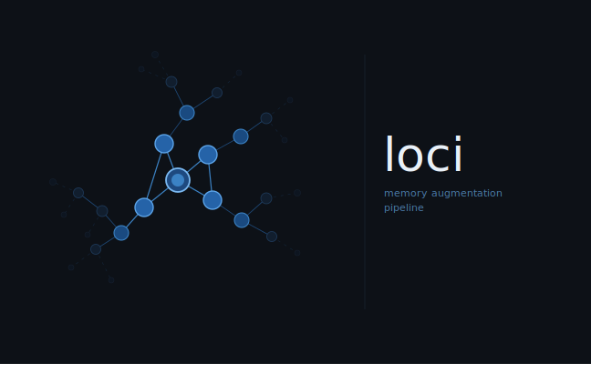

> _A memory-based context proxy for LLMs — semantic memory storage, session-aware retrieval,
> and transparent prompt enrichment._

[](LICENSE)

---

## What is loci?

**loci** (inspired by the [method of loci](https://en.wikipedia.org/wiki/Method_of_loci)
mnemonic technique) is a Rust library and CLI tool that acts as an intelligent middleware
layer between any client — a user, a script, an agent — and a target LLM.

Instead of every conversation starting from a blank slate, loci:

1. **Retrieves relevant memory entries** from a semantic vector store and injects them into the
   prompt as context before forwarding to the LLM.
2. **Streams model output** back to the caller via the `Contextualizer`.

The system is stateless in process — all memory state lives in Qdrant.

```
Client / REPL
     │  prompt
     ▼
┌──────────────────────────────────────┐
│           loci Contextualizer        │
│  1. query MemoryStore (semantic)     │
│  2. inject [MEMORY CONTEXT] block    │
│  3. forward enriched prompt ───────► │  Target LLM
│  ◄────────────────────────────────── │  (Ollama / any model provider)
│  4. stream response                  │
└──────────────────────────────────────┘
     │  response
     ▼
  Client / REPL
```

---

## Current State

The following is fully implemented and working today.

### Workspace

| Crate                        | Path                                | Purpose                                                    |
| ---------------------------- | ----------------------------------- | ---------------------------------------------------------- |
| `loci-core`                  | `crates/loci-core`                  | Traits, domain types, `Contextualizer`                     |
| `loci-memory-store-qdrant`   | `crates/loci-memory-store-qdrant`   | Qdrant-backed `MemoryStore` with lifecycle-aware retrieval |
| `loci-model-provider-ollama` | `crates/loci-model-provider-ollama` | Ollama embedding + text generation model provider          |
| `loci-config`                | `crates/loci-config`                | TOML config loading and secret resolution                  |
| `loci-cli`                   | `crates/loci-cli`                   | `loci` CLI binary for CRUD + prompt enhancement            |

### Core Abstractions (`loci-core`)

| Trait                         | Purpose                                                             |
| ----------------------------- | ------------------------------------------------------------------- |
| `MemoryStore`                 | Save, query, update, set tier, delete, prune expired memory entries |
| `TextEmbedder`                | Embed text into a vector                                            |
| `EmbeddingModelProvider`      | Raw embedding model provider (HTTP, model name)                     |
| `TextGenerationModelProvider` | Raw text generation model provider                                  |

Key domain types: `MemoryEntry`, `MemoryQueryResult`, `MemoryInput`, `MemoryQuery`, `MemoryTier`, `MemoryQueryMode`, `Score`, `Embedding`.

### Storage (`loci-memory-store-qdrant`)

`QdrantMemoryStore` uses [Qdrant](https://qdrant.tech/) for cosine-similarity vector search.

Features:

- Configurable deduplication (`similarity_threshold`) to reuse near-duplicates
- Tiered memory lifecycle (`Candidate`, `Stable`, `Core`; `Ephemeral` is request-scoped only)
- Per-tier TTL defaults and query-time expiry filtering
- Weighted retrieval ranking (`similarity * tier_weight`)
- Source-corroboration promotion (`Candidate -> Stable`) when the same fact is observed from a different `source` metadata value
- Manual curation path (`set_tier`) for promoting to `Core`
- Metadata filtering (AND semantics, exact match)
- Min score threshold and max result limits

### Model Providers (`loci-model-provider-ollama`)

`OllamaModelProvider` implements both `EmbeddingModelProvider` and `TextGenerationModelProvider`
against a local [Ollama](https://ollama.com/) instance.

Default models in the generated config:

- Embedding: `qwen3-embedding:0.6b` (768 dimensions)
- Text generation: `qwen3:0.6b`

---

## Getting Started

### Prerequisites

- [Rust](https://rustup.rs/) (2024 edition)
- [Docker](https://www.docker.com/) (for Qdrant)
- [Ollama](https://ollama.com/) — install and run natively (see "Ollama (native)" below)

### Start infrastructure

```bash
docker compose up -d
```

This starts:

- **Qdrant** on `http://localhost:6333` (HTTP) / `http://localhost:6334` (gRPC)

Note: Ollama is not started by the Docker compose setup in this repository. Due to GPU usage constraints Ollama must be installed and run natively on your machine (see "Ollama (native)" below).

### Ollama (native)

Ollama must be installed and started natively (it is not started by `docker compose` in this repository due to GPU usage constraints). Install instructions and platform-specific details are available at https://ollama.com/. Once Ollama is running (the default HTTP API is `http://localhost:11434`), pull the required models:

```bash
ollama pull qwen3-embedding:0.6b
ollama pull qwen3:0.6b
```

### Configure

Generate a default config file:

```bash
cargo run --bin loci -- config init
# Written to: ~/.config/loci/config.toml
```

Edit the file to point to your preferred models. The generated file contains comments
explaining every option.

### Build

```bash
cargo build --release
# Binary at: target/release/loci
```

Or run directly:

```bash
cargo run --bin loci -- <subcommand>
```

---

## CLI Reference

### Global options

| Flag               | Env var       | Default                      | Description              |
| ------------------ | ------------- | ---------------------------- | ------------------------ |
| `--config` / `-c`  | `LOCI_CONFIG` | `~/.config/loci/config.toml` | Path to TOML config file |
| `--verbose` / `-v` | —             | off                          | Enable debug logging     |

### `loci memory save`

Store a new memory.

```bash
loci memory save "The project uses Qdrant for vector storage"
loci memory save "Deployment target is Kubernetes" --meta env=production --meta team=platform
loci memory save "This is a curated fact" --tier core --meta source=manual
```

| Argument / Flag    | Description                                |
| ------------------ | ------------------------------------------ | ------ | -------------------------------- |
| `<content>`        | Memory text (required positional argument) |
| `--meta KEY=VALUE` | Metadata key-value pair (repeatable)       |
| `--tier <candidate | stable                                     | core>` | Optional persisted tier override |

### `loci memory query`

Retrieve semantically similar memory entries.

```bash
loci memory query "vector database"
loci memory query "deployment" --max-results 3 --min-score 0.7 --filter env=production
loci memory query "platform"
```

| Argument / Flag      | Default      | Description                                 |
| -------------------- | ------------ | ------------------------------------------- |
| `<topic>`            | _(required)_ | Query topic                                 |
| `--max-results <n>`  | `10`         | Maximum number of results                   |
| `--min-score <f64>`  | `0.0`        | Minimum weighted score [0.0, 1.0]           |
| `--filter KEY=VALUE` | _(none)_     | Metadata filter (repeatable, AND semantics) |

### `loci memory get`

Fetch one memory entry by UUID.

```bash
loci memory get <uuid>
```

### `loci memory update`

Update an existing memory by UUID.

```bash
loci memory update <uuid> "Updated content" --meta key=value
loci memory update <uuid> --tier core
loci memory update <uuid> --meta source=manual
```

| Argument / Flag    | Description                                       |
| ------------------ | ------------------------------------------------- | ------ | ---------------------- |
| `<uuid>`           | Memory entry ID (required)                        |
| `[content]`        | New content (optional positional argument)        |
| `--meta KEY=VALUE` | Replace metadata with provided pairs (repeatable) |
| `--tier <candidate | stable                                            | core>` | Optional tier override |

### `loci memory delete`

Remove a memory by UUID.

```bash
loci memory delete <uuid>
```

### `loci memory prune-expired`

Remove **all** expired memory entries from the collection.

```bash
loci memory clear
```

### `loci prompt`

Enhance a prompt with relevant memory entries and send it to the LLM.

```bash
loci prompt "What storage backend do we use?"
loci prompt "Summarise our deployment setup" --max-memory-entries 8 --min-score 0.5
```

| Flag                       | Default      | Description                                       |
| -------------------------- | ------------ | ------------------------------------------------- |
| `<prompt>`                 | _(required)_ | Prompt text (positional)                          |
| `--max-memory-entries <n>` | `5`          | Max memory entries to inject as context           |
| `--min-score <f64>`        | `0.5`        | Minimum weighted score for context memory entries |

### `loci config init`

Scaffold a default configuration file at the config path.

```bash
loci config init
loci --config /path/to/config.toml config init
```

### Memory config keys

```toml
[memory]
store = "qdrant"
collection = "memory_entries"
# similarity_threshold = 0.95     # deduplicate by semantic similarity
# promotion_source_threshold = 2  # promote Candidate -> Stable when corroborated by a different source
```

---

## Development

```bash
cargo check          # type-check workspace
cargo test           # run all unit tests
cargo clippy         # lint
cargo fmt            # format

# Integration tests (requires Docker)
cargo test -p loci-memory-store-qdrant -- --ignored --test-threads=1
```

---

## Roadmap

The items below are **planned** — they are not yet implemented.

### Session-Aware Memory Proxy

A `SessionStore` trait (pluggable: in-process HashMap, SQLite, Redis, …) keyed by a
session ID. Each session carries configuration (filters, model preferences, context window
size) and a lightweight interaction history. The proxy itself remains stateless — no
per-session state is held in process memory beyond the current request.

### Memory Extraction Strategies

After each LLM turn, the prompt/response pair is processed asynchronously by a
`MemoryExtractionStrategy`. Two built-in strategies are planned:

- **`LlmSummarizationStrategy`** — sends the pair to the LLM with a system prompt that
  extracts factual statements as new memory entries.
- **`KeywordEntityStrategy`** — lightweight keyword and entity extraction that does not
  require an additional LLM call.

The trait is open for extension; custom strategies can be plugged in.

### Enhanced REPL CLI

A chat-mode REPL for interactive sessions:

- Multi-turn conversation with persistent session state
- Line editing, input history, and auto-complete (`rustyline` or similar)
- Formatted memory context display with relevance scores
- Session ID management directly from the REPL prompt

### Protocol Layer

The long-term vision is to expose loci as a network proxy that any client can target
without modification. The specific protocol is undecided; an **OpenAI-compatible API** is
the leading candidate for maximum client interoperability.

---

## Contributing

Contributions are welcome! Please open an issue to discuss significant changes before
submitting a pull request.

```bash
# Fork, clone, create a feature branch
git checkout -b feat/my-feature

# Make changes, ensure tests pass
cargo test && cargo clippy

# Open a pull request
```

---

## License

MIT — see [LICENSE](LICENSE).

Copyright © 2026 Daniel Götten
